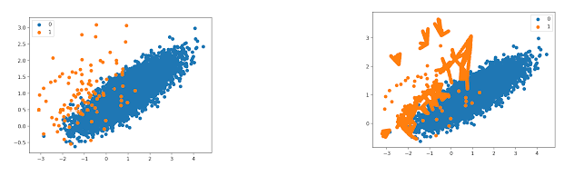

## Understanding SMOTE: SMITE Imbalanced Datasets with SMOTE

Have you ever trained a machine learning model, only to find that it’s really good at predicting the majority class but completely useless at detecting the minority class? It’s frustrating, right? You might be dealing with imbalanced data, a common issue in machine learning.

Think about fraud detection—99% of transactions might be legit, while only 1% are fraudulent. If your model predicts "not fraud" every time, it'll still be 99% accurate, but… it totally fails at detecting fraud. This is where SMOTE (Synthetic Minority Over-sampling Technique) comes in to save the day!

Let’s break it down in a way that makes sense.

## **The Problem: Why Imbalanced Data is a Nightmare**

When one class (e.g., "fraud") has way fewer examples than another (e.g., "legit transactions"), machine learning models tend to ignore the smaller class. Why? Because they’re trained to minimize overall error, and since the majority class dominates the dataset, the model learns to "play it safe" and predict the majority class most of the time.

But in real-world applications—fraud detection, medical diagnoses, spam filtering—we need the minority class to be detected accurately.

So, how do we fix this?

## **Introducing SMOTE: The Magic of Synthetic Data**

Imagine you’re trying to teach a kid how to recognize different tree leaves. You show them 10 pictures of maple leaves and only one picture of a oak leaf. They’ll probably just assume all leaves are maple leaves and ignore oak leaves. Now, what if you generate more oak leaf pictures by tweaking existing ones—changing angles, lighting, or even merging features from different images? That’s exactly what SMOTE does for data!

Instead of randomly duplicating minority class examples (which doesn’t add any new information), SMOTE creates new synthetic examples by interpolating between existing data points. This helps balance the dataset without overfitting.

Here’s how SMOTE works, step by step:

1.  Pick a minority class data point.

2.  Find its k-nearest minority class neighbors.

3.  Pick one of these neighbors at random.

4.  Generate a new synthetic data point somewhere between the two.

And there ya go! You have a more balanced dataset.

## **SMOTE in Pseudo-Code (Super Simple Version)**

Lets take a look at what happens under the hood. How does it actually work? Below is a very simplified block of pseudo code that breaks down the basics of the algorithm. It doesn't go into the details of the math, but it helps us understand the big idea.

``` python
Input: Minority class dataset X, number of samples needed N, nearest neighbors k

For each minority sample x in X:
    Find k nearest neighbors of x
    Pick one randomly: x_neighbor
    Create a new synthetic point:
        new_sample = x + random_value * (x_neighbor - x)
    Add new_sample to dataset
```

That’s all! It’s like filling in the gaps in your dataset with realistic, new examples.

## **Visualizing the Effects of SMOTE**

Now you're curious. Does it actually work? Lets take a look at the visual affects of SMOTE. Here is a before and after:



## **Limitations of SMOTE (Yes, It’s Not Perfect)**

You probably noticed the odd shapes that SMOTE created on the graph. Because SMOTE assumes linear interpolation is meaningful, it tends to create these lines in between original data point. This gives the new dataset a unnatural look.

Another limitation of SMOTE is class overlap. If the different classes are too close together, SMOTE might create some classified points. So yes, SMOTE isn't perfect, but it usually does the trick.

## **Summary**

If you’re working with imbalanced datasets, especially in:

Fraud detection\
Medical diagnosis\
Spam filtering\
Credit risk modeling

Then SMOTE is a game-changer. It helps even the playing field and gives your model a better shot at learning minority class patterns. But remember: garbage in, garbage out. If your data is messy, SMOTE won’t magically fix it. Always visualize your results, test different oversampling techniques, and tune your model accordingly.

Study the SMOTE documentation [here](https://imbalanced-learn.org/dev/references/generated/imblearn.over_sampling.SMOTE.html) to learn how to balance your datasets!
